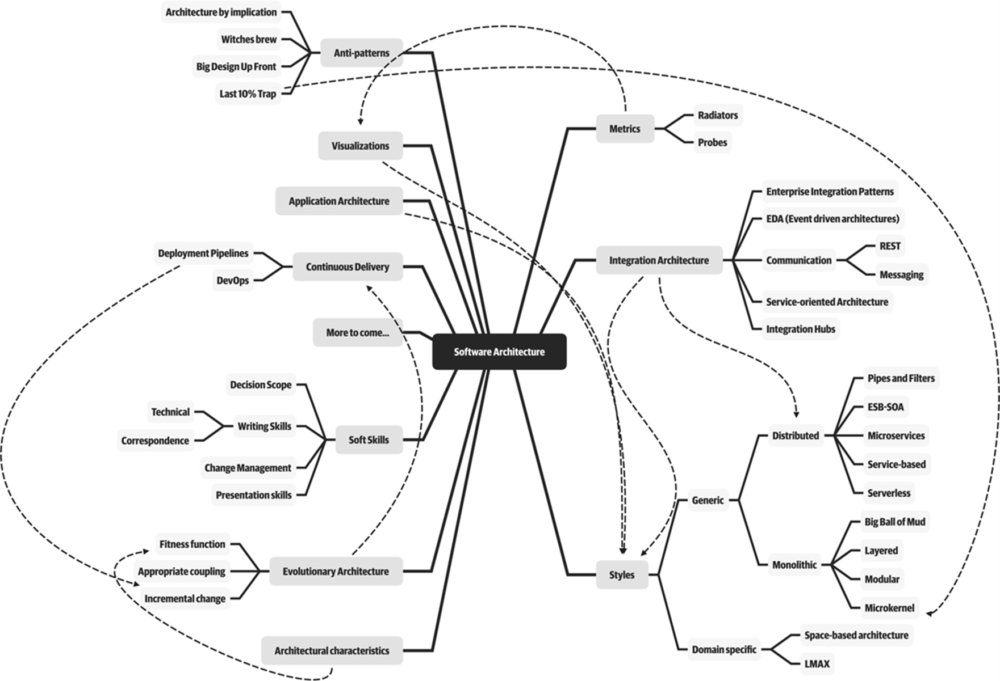

# Fundamentos de la arquitectura de Software

## Definiciones

>The software architecture of a system is the set of structures needed to reason about the system. These structures comprise software elements, relations among them and properties of both.

Architecture in practice 4th Ed.

>Architecture is about the important stuff…whatever that is...

Ralph Johnson

>An architecture is the set of significant decisions about the organization of a software system, the selection of structural elements and their interfaces by which the system is composed, together with their behavior as specified in the collaborations among those elements, the composition of these elements into progressively larger subsystems, and the architectural style that guides this organization -- these elements and their interfaces, their collaborations, and their composition.

Philippe Kruchten [RUP 2023]

>Architecture is the fundamental organization of a system embodied in its components, their relationships to each other, and to the environment, and the principles guiding its design and evolution.

IEEE  1471 - 2000

## Implicaciones de la definición

**La arquitectura es un conjunto de estructuras de software**

Una estructura en set de elementos unidos por una relación. Los sistemas de software están compuestos por muchas estructuras y no hay una estructura única que pueda reclamar se la arquitectura.

**La arquitectura es una abstracción**

Dado que la arquitectura consta de estructuras, y las estructuras se componen de elementos y relaciones; en consecuencia, tenemos que una arquitectura comprende elementos de software y cómo estos elementos se relacionan entre sí. Esto significa que la arquitectura, específica e intencionalmente, omite cierta información sobre los elementos que no son útiles para el razonamiento del sistema. De modo que la arquitectura es, en esencia, la abstracción de un sistema que selecciona ciertos detalles y omite otros.

**Arquitectura vs. Diseño**

La arquitectura es diseño, pero no todo lo que es diseño es arquitectura. Es decir que no todas las decisiones de diseño terminan por estar vinculadas a la arquitectura dado que es, después de todo, una abstracción y dependen entonces de la discreción y buen juicio de los diseñadores posteriores, e incluso, de quienes la implementarán.

**Todo sistema tiene una arquitectura**

Todo sistema tiene una arquitectura, porque todos los sistemas tienen elementos y relaciones. Esto demuestra que existe una diferencia entre la arquitectura de un sistema y la representación de ella. Dado que una arquitectura puede existir independientemente de su descripción o especificación, esto muestra la importancia de la documentación de la arquitectura. 

**No todas las arquitecturas son buenas arquitecturas**

Nuestra definición es indiferente sobre si la arquitectura de un sistema es buena o mala. Una determinada arquitectura puede favorecer o dificultar la consecución de necesidades importantes para el sistema.

**La arquitectura incluye el comportamiento**

El comportamiento de cada elemento es parte de la arquitectura en la medida en que el comportamiento puede ayudarnos a pensar acerca del sistema. El comportamiento de los elementos refleja cómo interactúan entre ellos y con el ambiente.

# Leyes y alcance de la arquitectura de Software

## Leyes de la arquitectura de Software

*Primera ley:* Todo en la arquitectura de Software es un intercambio (Trade-off)

*Segunda ley:* El porqué es más importante que el cómo

## Alcance de la arquitectura de Software

- Las responsabilidades de un arquitecto de software abarcan habilidades técnicas, habilidades blandas, conciencia operativa y muchas otras.

- La arquitectura consiste en la estructura combinada con las características de la arquitectura ("-ilidades"), las decisiones de arquitectura y los principios de diseño.

- La estructura se refiere al tipo de estilos de arquitectura utilizados en el sistema.

- Las características de la arquitectura se refieren a las  "-ilidades" que el sistema debe soportar.

- Las decisiones de arquitectura son reglas para construir sistemas.

- Los principios de diseño son pautas para construir sistemas. 

Credits: Fundamentas of Software Architecture

# La importancia de la Arquitectura de Software 

En la arquitectura de software, las decisiones clave definen la estructura y el comportamiento del sistema, mientras que las restricciones actúan como límites que guían el diseño y la implementación. Comprender las restricciones del negocio, las limitaciones tecnológicas y los recursos disponibles es esencial para tomar decisiones arquitectónicas efectivas. Estas decisiones no solo configuran el sistema desde su creación, sino que también impactan su evolución a lo largo del tiempo, influyendo en aspectos cruciales como la performance, la seguridad y la facilidad de mantenimiento del software. 

# Restricciones y decisiones de la arquitectura

## Restricciones de arquitectura
En la arquitectura de software, las restricciones son cierto tipo de regalas o limitaciones que dictan ciertos aspectos del diseño y la implementación del sistema.

Estas restricciones pueden originarse a partir de requerimientos específicos del negocio, limitaciones tecnológicas, o el capital humano disponible, entre otros factores. Comprender y gestionar estas restricciones es crucial para el éxito de un proyecto de software, ya que influyen significativamente en las decisiones arquitectónicas (Bass, Clements, y Kazman, 2015).

### Restricciones de negocio
Las restricciones de negocio se derivan de las necesidades, estrategias, y objetivos específicos de la organización que implementa el sistema. Estas incluyen:

**Requisitos de mercado:** como la necesidad de lanzar un producto antes de una fecha específica para captar una oportunidad de mercado.

**Presupuesto:** limitaciones en los recursos financieros disponibles que pueden afectar la elección de tecnologías o la capacidad de implementar ciertas características.

**Regulaciones y cumplimiento legal:** normativas que el software debe cumplir, lo que puede limitar las opciones de diseño o requerir ciertas funcionalidades.

### Restricciones de tecnología

Las restricciones tecnológicas están relacionadas con las herramientas, plataformas, y estándares existentes que deben ser utilizados en el desarrollo del sistema. Estas incluyen:

**Compatibilidad con sistemas existentes:** requisitos para que el nuevo sistema funcione con sistemas legados o tecnologías específicas preexistentes.

**Infraestructura disponible:** las capacidades de la infraestructura actual que pueden limitar el rendimiento o la escalabilidad del sistema.

**Tecnologías obligatorias:** Decisiones corporativas o de proyecto que requieren el uso de ciertas herramientas o tecnologías, a veces por razones de seguridad, soporte o acuerdos preexistentes con proveedores.

### Restricciones de personas / conocimiento

Estas restricciones están ligadas a las habilidades, experiencia y número de personal disponible para trabajar en el proyecto; estas abarcan lo siguiente:

**Experiencia del equipo:** las tecnologías o metodologías que el equipo domina pueden influir en la arquitectura elegida.

**Disponibilidad de especialistas:** la falta de expertos en un área tecnológica específica puede limitar las opciones de diseño o requerir capacitación adicional, impactando los plazos y costos.

**Cultura organizacional:** las preferencias o aversiones de la organización hacia ciertas prácticas o tecnologías también pueden imponer restricciones en el diseño del sistema.

## Decisiones de arquitectura

Las decisiones de arquitectura son elecciones fundamentales que definen la estructura y el comportamiento de un sistema de software. Estas decisiones abordan problemas críticos del diseño del sistema y establecen las bases sobre las cuales el software sera construido y evolucionará a lo largo del tiempo. (Bass, Clements, y Kazman, 2012).

Estas, son cruciales porque configuran el marco dentro del cual se tomarán todas las demás decisiones técnicas. Afectan la selección de tecnologías, la formulación de políticas de desarrollo y mantenimiento y las estrategias de implementación. Al definir cómo se organizan y se interconectan los componentes del software, estas decisiones impactan directamente en la capacidad del sistema para cumplir con los requisitos funcionales y no funcionales, influenciando atributos de calidad como la performance, la seguridad, y la facilidad de mantenimiento

### Consecuencias de malas decisiones de arquitectura

**Rigidez del Sistema:** una arquitectura mal diseñada puede ser difícil de modificar y expandir, lo que puede obstaculizar la adaptación del sistema a nuevos requisitos o tecnologías.

**Costos incrementados:** decisiones equivocadas pueden resultar en retrabajos costosos y aumentos en el tiempo de desarrollo y mantenimiento.

**Degradación del rendimiento:** una arquitectura que no considera adecuadamente los atributos de rendimiento necesarios puede llevar a un sistema que no cumple con las expectativas de los usuarios o los estándares de la industria.

### Consecuencias de buenas decisiones de arquitectura

**Consistencia y cohesión:** facilita la integración de diferentes componentes y promueve un enfoque uniforme en el desarrollo.

**Claridad y comunicabilidad:** hace que la arquitectura sea más fácil de entender y comunicar a todas las partes interesadas, reduciendo así los riesgos de malentendidos y errores en las fases de desarrollo.

**Flexibilidad y escalabilidad:** permite que el sistema se adapte más fácilmente a cambios en los requisitos o en el entorno tecnológico.

