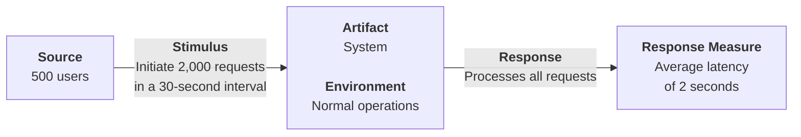
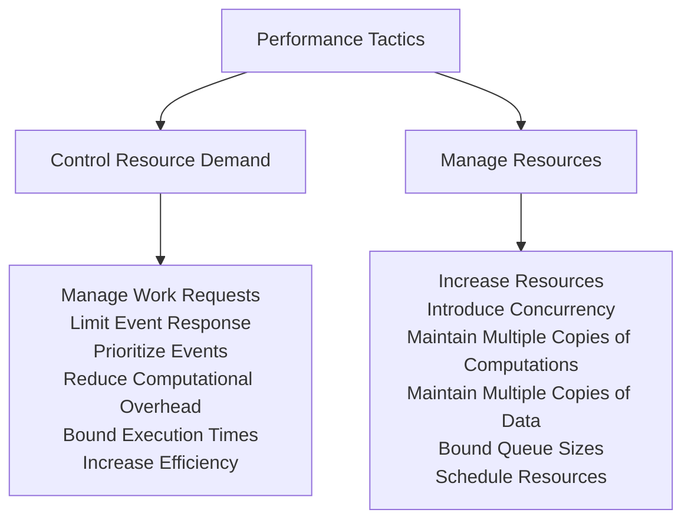
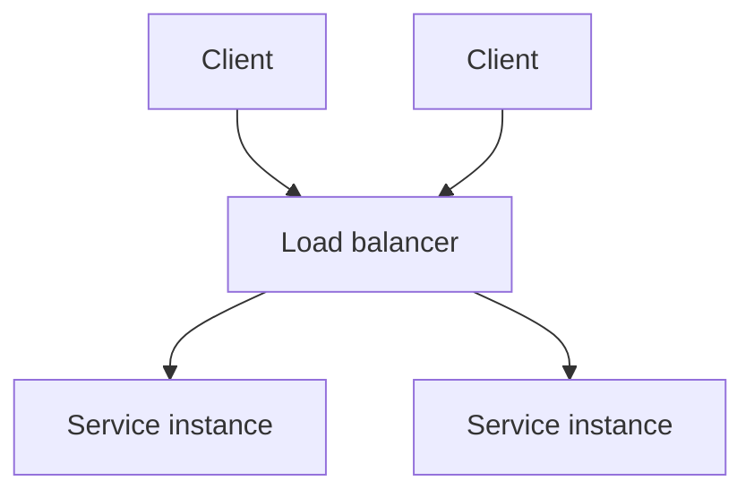

# Desempeño (Performance)

## Definición

> *"It's about time"*

**Desempeño** es eso: se trata de tiempo y de la capacidad del sistema para cumplir con los requisitos de tiempo. El hecho es que las operaciones en las computadoras toman tiempo. Los cálculos toman un tiempo del orden de miles de nanosegundos, el acceso al disco (ya sea de estado sólido o giratorio) toma un tiempo del orden de decenas de milisegundos, y el acceso a la red toma un tiempo que va desde cientos de microsegundos dentro del mismo centro de datos hasta más de 100 milisegundos para mensajes intercontinentales. El tiempo debe tenerse en cuenta al diseñar su sistema para el rendimiento.

## Concurrencia

La ***concurrencia*** es uno de los conceptos más importantes que un arquitecto debe comprender y uno de los temas menos enseñados en los cursos de informática. **La concurrencia se refiere a las operaciones que ocurren en paralelo.**

La ***concurrencia*** ocurre cada vez que su sistema crea un nuevo subproceso (*thread*), porque los subprocesos, por definición, son secuencias de control independientes. La multitarea en su sistema es compatible con subprocesos independientes. Múltiples usuarios son atendidos simultáneamente en su sistema mediante el uso de subprocesos. La simultaneidad también ocurre cada vez que su sistema se ejecuta en más de un procesador, ya sea que esos procesadores estén empaquetados por separado o como procesadores de múltiples núcleos.

# Escenario

## Escenario general

| Portion of Scenario | Description | Possible Values |
|---|---|---|
| **Source** | The stimulus can come from a user (or multiple users), from an external system, or from some portion of the system under consideration. | **External:** User request; Request from external system; Data arriving from a sensor or other system. **Internal:** One component may make a request of another component; A timer may generate a notification. |
| **Stimulus** | The stimulus is the arrival of an event. The event can be a request for service or a notification of some state of either the system under consideration or an external system. | Arrival of a periodic, sporadic, or stochastic event: a *periodic* event arrives at a predictable interval; a *stochastic* event arrives according to some probability distribution; a *sporadic* event arrives according to a pattern that is neither periodic nor stochastic. |
| **Artifacts** | The artifact stimulated may be the whole system or just a portion of the system. For example, a power-on event may stimulate the whole system. A user request may arrive at (stimulate) the user interface. | Whole system; Component within the system. |
| **Environment** | The state of the system or component when the stimulus arrives. Unusual modes—error mode, overloaded mode—will affect the response. For example, three unsuccessful login attempts are allowed before a device is locked out. | Runtime. The system or component can be operating in: Normal mode, Emergency mode, Error correction mode, Peak load, Overload mode, Degraded operation mode, Some other defined mode of the system. |
| **Response** | The system will process the stimulus. Processing the stimulus will take time. This time may be required for computation, or it may be required because processing is blocked by contention for shared resources. Requests can fail to be satisfied because the system is overloaded or because of a failure somewhere in the processing chain. | System returns a response; System returns an error; System generates no response; System ignores the request if overloaded; System changes the mode or level of service; System services a higher-priority event; System consumes resources. |
| **Response measure** | System returns a response; System returns an error; System generates no response; System ignores the request if overloaded; System changes the mode or level of service; System services a higher-priority event; System consumes resources. | The (maximum, minimum, mean, median) time the response takes (**latency**); The number or percentage of satisfied requests over some time interval (**throughput**) or set of events received; The number or percentage of requests that go unsatisfied; The variation in response time (**jitter**); Usage level of a computing resource. |

## Ejemplo de un escenario concreto

> 500 usuarios inician 2.000 solicitudes en un intervalo de 30 segundos, en condiciones normales de funcionamiento. El sistema procesa todas las solicitudes con una latencia promedio de dos segundos.

# Tácticas

**Objetivo:** generar una respuesta a los eventos que llegan al sistema bajo alguna restricción basada en el tiempo o en los recursos. El evento puede ser uno solo o una secuencia, y es el desencadenante para realizar el cálculo. Las tácticas de desempeño controlan el tiempo o los recursos utilizados para generar una respuesta.

En cualquier momento durante el período posterior a la llegada de un evento, pero antes de que se complete la respuesta, el sistema o está trabajando para responder a ese evento o el procesamiento está bloqueado por algún motivo. Esto lleva a los dos contribuyentes básicos al tiempo de respuesta y al uso de recursos: ***tiempo de procesamiento*** (cuando el sistema está trabajando para responder y consumiendo recursos activamente) y ***tiempo bloqueado*** (cuando el sistema no puede responder).

**Tiempo de procesamiento y uso de recursos**

El procesamiento consume recursos, lo que lleva tiempo. Los eventos son manejados por la ejecución de uno o más componentes, cuyo tiempo empleado es un recurso. Los recursos de hardware incluyen CPU, almacenes de datos, ancho de banda de comunicación de red y memoria. Los recursos de software incluyen entidades definidas por el sistema bajo diseño. Por ejemplo, los grupos de subprocesos (*thread pools*) y los búferes deben administrarse y el acceso a las secciones críticas debe ser secuencial.

Por ejemplo, supongamos que un componente genera un mensaje. Puede colocarse en la red, luego de lo cual llega a otro componente. Luego se coloca en un búfer; se transforma de alguna manera; se procesa de acuerdo con algún algoritmo; se transforma para la salida; se coloca en un búfer de salida; y se envía hacia algún componente, otro sistema o algún actor. Cada uno de estos pasos contribuye a la ***latencia*** general y al consumo de recursos del procesamiento de ese evento.

**Tiempo bloqueado y contención de recursos**

Un cómputo se puede bloquear debido a la contención de algún recurso necesario, porque el recurso no está disponible o porque el cómputo depende del resultado de otros cómputos que aún no están disponibles:

- ***Contención de recursos.*** Muchos recursos solo pueden ser utilizados por un cliente a la vez. Como consecuencia, otros clientes deben esperar para acceder a esos recursos.
- ***Disponibilidad de recursos.*** Incluso en ausencia de contención, el cálculo no puede continuar si un recurso no está disponible. La falta de disponibilidad puede deberse a que el recurso esté fuera de línea o a una falla del componente por cualquier motivo.
- ***Dependencia de otros cálculos.*** Un cómputo puede tener que esperar porque debe sincronizarse con los resultados de otro cómputo o porque está esperando los resultados de un cómputo que inició.

## Tácticas de desempeño

Fuente: *Software Architecture in Practice, 4th Edition*

# Tácticas - Control Resource Demand

Una forma de aumentar el rendimiento es administrar cuidadosamente la demanda de recursos. Esto se puede hacer reduciendo la cantidad de eventos procesados o limitando la velocidad a la que el sistema responde a los eventos.

**Gestionar solicitudes de trabajo (Manage work requests)**

Una forma de reducir el trabajo es reducir la cantidad de solicitudes que ingresan al sistema para realizar el trabajo. Las formas de hacerlo incluyen lo siguiente:

- ***Gestionar la llegada de eventos.*** Una forma común de administrar las llegadas de eventos desde un sistema externo es establecer un acuerdo de nivel de servicio (SLA) que especifique la tasa máxima de llegada de eventos que está dispuesto a admitir. Un SLA es un acuerdo de la forma "El sistema o componente procesará X eventos que lleguen por unidad de tiempo con un tiempo de respuesta de Y". Este acuerdo restringe tanto al sistema (debe proporcionar esa respuesta) como al cliente (si realiza más de X solicitudes por unidad de tiempo, la respuesta no está garantizada).
- ***Administrar la frecuencia de muestreo.*** En los casos en que el sistema no pueda mantener niveles de respuesta adecuados, puede reducir la frecuencia de muestreo de los estímulos, por ejemplo, la velocidad a la que se reciben los datos de un sensor o la cantidad de cuadros de video por segundo que procesa. Por supuesto, el precio que se paga aquí es la fidelidad de la transmisión de video o la información que recopila de los datos del sensor.

**Limitar la respuesta al evento (Limit event response)**

Cuando los eventos llegan al sistema (o componente) demasiado rápido para ser procesados, entonces los eventos deben ponerse en cola hasta que puedan procesarse, o simplemente se descartan. Puede elegir procesar eventos solo hasta una tasa máxima establecida, lo que garantiza un procesamiento predecible para los eventos que realmente se procesan.

**Priorizar eventos (Prioritize events)**

Si no todos los eventos son igualmente importantes, puede imponer un esquema de prioridad que clasifique los eventos según la importancia de atenderlos. Si no hay suficientes recursos disponibles para atenderlos cuando surjan, es posible que se ignoren los eventos de baja prioridad. Ignorar eventos consume recursos mínimos (incluido el tiempo), lo que aumenta el rendimiento en comparación con un sistema que atiende todos los eventos todo el tiempo.

**Reducir la sobrecarga computacional (Reduce computational overhead)**

Para los eventos que sí ingresan al sistema, se pueden implementar los siguientes enfoques para reducir la cantidad de trabajo involucrado en el manejo de cada evento:

- Reducir la indirección
- Coubicar los recursos de comunicación
- Limpieza periódica

**Tiempos de ejecución acotados (Bound execution times)**

Puede poner un límite a la cantidad de tiempo de ejecución que se utiliza para responder a un evento. Para algoritmos iterativos dependientes de datos, limitar el número de iteraciones es un método para acotar los tiempos de ejecución. Sin embargo, el costo suele ser un cálculo menos preciso. Si adopta esta táctica, deberá evaluar su efecto sobre la precisión y ver si el resultado es "suficientemente bueno". Esta táctica de gestión de recursos se combina con frecuencia con la táctica de gestión de la tasa de muestreo.

**Aumentar la eficiencia en el uso de los recursos (Increase efficiency)**

Mejorar la eficiencia de los algoritmos utilizados en áreas críticas puede disminuir la latencia y mejorar el rendimiento y el consumo de recursos. Esta es, para algunos programadores, su principal táctica de rendimiento. Si el sistema no funciona adecuadamente, intentan "afinar" su lógica de procesamiento.

# Tácticas - Manage Resources

**Aumentar los recursos (Increase resources)**

Los procesadores más rápidos, los procesadores adicionales, la memoria adicional y las redes más rápidas tienen el potencial de mejorar el rendimiento. El costo suele ser una consideración en la elección de los recursos, pero aumentarlos es, en muchos casos, la forma más económica de obtener una mejora inmediata.

**Introducir la concurrencia (Introduce concurrency)**

Si las solicitudes se pueden procesar en paralelo, el tiempo bloqueado se puede reducir. La simultaneidad se puede introducir procesando diferentes flujos de eventos en diferentes subprocesos o creando subprocesos adicionales para procesar diferentes conjuntos de actividades.

**Mantener múltiples copias de cómputo (Maintain multiple copies of computations)**

Esta táctica reduce la contención que ocurriría si todas las solicitudes de servicio se asignaran a una sola instancia. Los servicios replicados en una arquitectura de microservicios o los servidores web replicados en un grupo de servidores son ejemplos de réplicas de computación. Un balanceador de carga es una pieza de software que asigna trabajo nuevo a uno de los servidores duplicados disponibles; los criterios de asignación varían, pero pueden ser tan simples como un esquema de turnos (*round robin*) o asignar la siguiente solicitud al servidor menos ocupado.

**Mantener múltiples copias de datos (Maintain multiple copies of data)**

Dos ejemplos comunes de mantenimiento de múltiples copias de datos son la *replicación de datos* y el *almacenamiento en caché*.

La **replicación de datos** implica mantener copias separadas de los datos para reducir la contención de múltiples accesos simultáneos. Debido a que los datos que se replican suelen ser una copia de los datos existentes, mantener las copias coherentes y sincronizadas se convierte en una responsabilidad que debe asumir el sistema.

El **almacenamiento en caché** también implica mantener copias de datos (con un conjunto de datos que posiblemente sea un subconjunto del otro), pero en almacenamiento con diferentes velocidades de acceso.

**Tamaños de cola limitados (Bound queue sizes)**

Esta táctica controla el número máximo de llegadas en cola y, en consecuencia, los recursos utilizados para procesar las llegadas. Si adopta esta táctica, debe establecer una política sobre lo que sucede cuando las colas se desbordan y decidir si es aceptable no responder a los eventos perdidos. Esta táctica se combina frecuentemente con la táctica de limitar la respuesta al evento.

**Programar recursos (Schedule resources)**

Cada vez que se produce una contención por un recurso, se debe programar (*schedule*) el recurso. Los procesadores se programan, los búferes se programan y las redes se programan. Su preocupación como arquitecto es entender las características del uso de cada recurso y elegir la estrategia de programación que sea compatible con él.

**Políticas de programación (Scheduling policies)**

Una política de programación tiene conceptualmente dos partes: una asignación de prioridad y un despacho. Todas las políticas de programación asignan prioridades. En algunos casos, la asignación es tan simple como primero en entrar/primero en salir (FIFO). En otros casos, puede estar ligada a la fecha límite de la solicitud o a su importancia semántica. Los criterios en competencia para la programación incluyen el uso óptimo de los recursos, la importancia de la solicitud, la minimización de la cantidad de recursos utilizados, la minimización de la latencia, la maximización del rendimiento, la prevención de la inanición (*starvation*) para garantizar la equidad, etc.

Algunas políticas de programación:

- Primero en entrar, primero en salir (FIFO)
- Programación de prioridad fija
- Importancia semántica
- Programación dinámica de prioridades: *Round robin*, *Earliest-deadline-first*, *Least-slack-first*
- Programación estática

# Patrones de desempeño

## Service Mesh (Malla de servicios)

El patrón de malla de servicios se utiliza en arquitecturas de microservicios. La característica principal de la malla es un *sidecar*, una especie de proxy que acompaña a cada microservicio y que brinda capacidades ampliamente útiles para abordar problemas independientes de la aplicación, como las comunicaciones entre servicios, el monitoreo y la seguridad. Un sidecar se ejecuta junto con cada microservicio y maneja toda la comunicación y coordinación entre servicios. Se despliegan juntos, lo que reduce la latencia debida a la red y, por lo tanto, aumenta el rendimiento. Este enfoque permite a los desarrolladores separar la funcionalidad (la lógica de negocio central) del microservicio de la implementación, la gestión y el mantenimiento de aspectos transversales, como la autenticación y la autorización, el descubrimiento de servicios, el balanceo de carga, el cifrado y la observabilidad.

[Fuente: TechTarget – Service Mesh](https://www.techtarget.com/it-infrastructure/definition/What-is-a-service-mesh)

**Beneficios**

- El software para gestionar las preocupaciones transversales se puede comprar listo para usar, o puede implementarlo y mantenerlo un equipo de especialistas que no hace nada más, lo que permite a los desarrolladores de la lógica de negocio centrarse solo en esa preocupación.
- Una malla de servicios impone el despliegue de las funciones de utilidad en el mismo procesador que los servicios que usan esas funciones. Esto reduce el tiempo de comunicación entre el servicio y sus utilidades, ya que la comunicación no necesita usar mensajes de red.
- La malla de servicios se puede configurar para que la comunicación dependa del contexto, lo que simplifica funciones como las pruebas *Canary* y *A/B*.

**Tradeoffs**

- Los sidecars introducen más procesos de ejecución, y cada uno de ellos consumirá algo de potencia de procesamiento, lo que aumentará la sobrecarga del sistema.
- Un sidecar normalmente incluye múltiples funciones, y no todas serán necesarias en cada servicio o en cada invocación de un servicio.

## Load Balancer (Balanceador de carga)

Un balanceador de carga es un tipo de intermediario que maneja los mensajes que se originan en un conjunto de clientes y determina qué instancia de un servicio debe responder a esos mensajes. La clave de este patrón es que el balanceador de carga sirve como un único punto de contacto para los mensajes entrantes, por ejemplo, una sola dirección IP, pero luego distribuye las solicitudes a un grupo de proveedores (servidores o servicios) que pueden responder a la petición. De esta forma, la carga se puede equilibrar entre el grupo de proveedores. El balanceador de carga implementa algún tipo de táctica de programación de recursos. El algoritmo de programación puede ser muy simple, como por turnos, o puede tener en cuenta la carga de cada proveedor, o el número de solicitudes en espera de servicio en cada proveedor.

Fuente: *Software Architecture in Practice, 4th Edition*

**Beneficios**

- Cualquier falla de un servidor es invisible para los clientes (suponiendo que aún queden algunos recursos de procesamiento).
- Al compartir la carga entre varios proveedores, la latencia se puede mantener más baja y más predecible para los clientes.
- Es relativamente simple agregar más recursos (más servidores, servidores más rápidos) al grupo disponible para el balanceador de carga, y ningún cliente necesita saberlo.

**Tradeoffs**

- El algoritmo de balanceo de carga debe ser muy rápido; de lo contrario, puede contribuir a problemas de rendimiento.
- El balanceador de carga es un cuello de botella potencial o un punto único de falla, por lo que a menudo se replica (e incluso se le balancea la carga).

## Throttling (Estrangulamiento / Limitación)

El patrón de limitación es un empaquetamiento de la táctica de gestión de solicitudes de trabajo. Se utiliza para limitar el acceso a algún recurso o servicio importante. En este patrón, normalmente hay un intermediario, un regulador (*throttler*), que supervisa las solicitudes al servicio y determina si se puede atender una solicitud entrante.

[Fuente: RedHat – Understanding Throttling Architecture Pattern](https://www.redhat.com/en/blog/pros-and-cons-throttling)

**Beneficios**

- Al limitar las solicitudes entrantes, se pueden manejar con elegancia las variaciones en la demanda. Al hacerlo, los servicios nunca se sobrecargan; se pueden mantener en un "punto óptimo" de rendimiento donde manejan las solicitudes de manera eficiente.

**Tradeoffs**

- La lógica de estrangulamiento debe ser muy rápida; de lo contrario, puede contribuir a problemas de rendimiento.
- Si la demanda de los clientes excede regularmente la capacidad, los búferes deberán ser muy grandes o existe el riesgo de perder solicitudes.
- Este patrón puede ser difícil de agregar a un sistema existente donde los clientes y los servidores están estrechamente acoplados.

## Map-Reduce

El patrón map-reduce realiza eficientemente un ordenamiento distribuido y paralelo de un gran conjunto de datos y proporciona un medio simple para que el programador especifique el análisis que se realizará. A diferencia de los otros patrones de rendimiento, que son independientes de cualquier aplicación, el patrón map-reduce está diseñado específicamente para brindar un alto rendimiento a un tipo específico de problema recurrente: ordenar y analizar un gran conjunto de datos. Este problema lo experimenta cualquier organización que maneja datos masivos (piense en Google, Facebook, Yahoo y Netflix) y todas estas organizaciones, de hecho, usan map-reduce.

El patrón map-reduce tiene tres partes:

1. **Infraestructura:** una infraestructura especializada que se encarga de asignar software a los nodos de hardware en un entorno informático masivamente paralelo y maneja el ordenamiento de los datos según sea necesario. La segunda y la tercera parte son dos funciones codificadas por el programador llamadas, como era de esperar, **map** y **reduce**.
2. **Map:** la función *map* toma como entrada una clave y un conjunto de datos. Utiliza la clave para distribuir los datos en un conjunto de *buckets*. Un archivo de entrada se divide en partes y se crean varias instancias de map para procesar cada parte. Una vez que se han mapeado todos los datos de entrada, la infraestructura map-reduce mezcla estos buckets y luego los asigna a nuevos nodos de procesamiento (posiblemente reutilizando los nodos utilizados en la fase de mapeo) para la fase de reducción. Por ejemplo, todos los tréboles podrían asignarse a un grupo de instancias, todos los diamantes a otro grupo, y así sucesivamente.
3. **Reduce:** todo el análisis pesado tiene lugar en la función de reducción. El número de instancias de reducción corresponde al número de buckets generados por la función map. La fase de reducción hace un análisis especificado por el programador y luego emite los resultados de ese análisis. El conjunto de salida es casi siempre mucho más pequeño que los conjuntos de entrada, de ahí el nombre "reducir".

**Ejemplo: conteo de letras**

[Fuente: Map Reduce 101 - Python Implementation (Multi Threading)](https://vipanchikatthula.github.io/post/mapper-reducer-implementation/)

**Ejemplo: total de órdenes por cliente (MongoDB)**

[Fuente: MongoDB Manual – Map Reduce](https://www.mongodb.com/docs/manual/core/map-reduce/)

**Beneficios**

- Los conjuntos de datos sin ordenar extremadamente grandes se pueden analizar de manera eficiente mediante la explotación del paralelismo.
- Una falla de cualquier instancia tiene solo un pequeño impacto en el procesamiento, ya que map-reduce generalmente divide grandes conjuntos de datos de entrada en muchos más pequeños para su procesamiento, asignando cada uno a su propia instancia.

**Tradeoffs**

- Si no tiene grandes conjuntos de datos, la sobrecarga que genera el patrón map-reduce no está justificada.
- Si no puede dividir su conjunto de datos en subconjuntos de tamaño similar, se perderán las ventajas del paralelismo.
- Las operaciones que requieren múltiples reducciones son complejas de orquestar.

# Tipos de pruebas de performance

| Tipo de prueba | Objetivo | Perfil de carga |
|---|---|---|
| **Prueba de carga** | Validar el rendimiento objetivo de la aplicación (ej. tiempo de respuesta inferior a X segundos). | Sube rápido hasta la carga esperada y se mantiene constante. |
| **Prueba de estrés** | Conocer los tiempos de respuesta durante los períodos pico, o encontrar los límites de rendimiento de la aplicación. | Escalones de carga crecientes, o una rampa que aumenta continuamente hasta romper. |
| **Prueba de resistencia** | Verificar la aplicación durante un período prolongado para detectar problemas de estabilidad (ej. fugas de memoria). | Carga constante durante horas. |
| **Prueba de resiliencia** | Simular una falla durante una prueba de carga para verificar la robustez. | Carga constante con una falla inyectada a mitad de la prueba. |
| **Prueba de pico** | Observar el comportamiento de los servidores durante un cambio repentino de carga. | Carga base baja con picos súbitos y muy altos. |

Fuente: Performance Testing United / Qualizens

# Bibliografía

Len Bass, Paul Clements, Rick Kazman. *Software Architecture in Practice*. 4th Edition. SEI / Addison-Wesley, 2022.